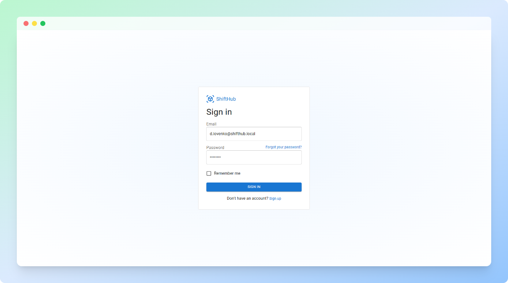
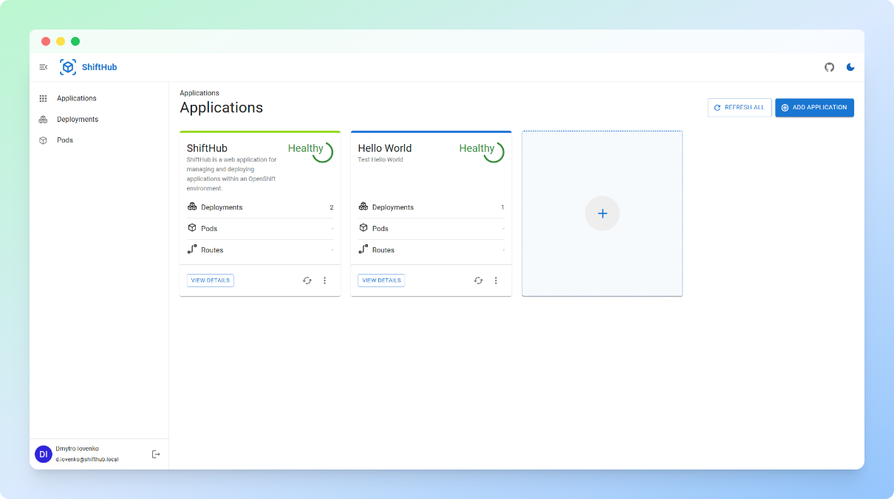
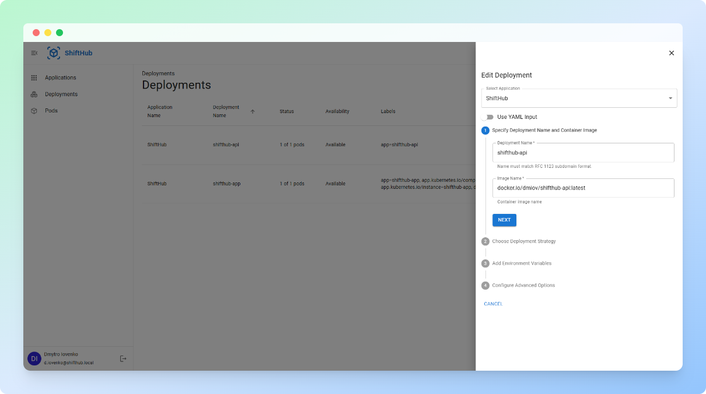

# ShiftHub

**ShiftHub** is a web application for managing and deploying applications within an OpenShift environment. It provides a user-friendly interface for both **frontend and backend management**, with features like real-time deployment monitoring, application lifecycle management, and secure user authentication.

Built for both developers and operational teams, ShiftHub enables users to manage their workloads, track application health, and streamline deployment operations on OpenShift.

**Current Limitations:** ShiftHub is still evolving. Future features will include management of **pods**, **services**, and **routes** directly within OpenShift. Stay tuned for updates.

## Key Features

### Frontend
- **User Authentication**: Secure JWT-based login, account management, and password resets.
- **Application Management**: Create, update, and delete applications; monitor deployment status and health.
- **Deployment Management**: Create, scale, and roll back deployments (via forms or YAML uploads); monitor deployment health.

### Backend
- **API Integration**: RESTful API to manage apps and deployments, integrated with OpenShift for real-time deployment management.
- **User Authentication**: JWT-based authentication with sign-up, login, and password reset functionality.
- **Deployment Management**: Support for creating, updating, scaling, and rolling back deployments. Real-time synchronization with OpenShift.

## Backend API Integration with OpenShift

The backend of **ShiftHub** integrates with OpenShift's API, allowing real-time management of application deployments. You can create, update, scale, and roll back deployments, directly interacting with OpenShift clusters. This enables developers to perform key deployment actions from a user-friendly interface.

**Key Operations Supported**:
- **Create and Scale Deployments**: Add new application deployments or scale existing ones.
- **Monitor Health**: Real-time health checks and replica counts.
- **Rollback Deployments**: Revert to a previous deployment state when needed.

## Deployment to OpenShift

ShiftHub is designed for seamless deployment within an OpenShift cluster. The provided YAML files define deployment settings, services, and routes, allowing you to quickly deploy the app on OpenShift.

- **Frontend Deployment YAML**: This file contains the configuration for the frontend application, including replicas, services, and routes.
- **Backend Deployment YAML**: The backend YAML is designed to deploy the API service and connect it to OpenShift for real-time deployment management.

Below is an example YAML for the frontend deployment:
```yaml
apiVersion: apps/v1
kind: Deployment
metadata:
  name: shifthub-app
spec:
  replicas: 1
  selector:
    matchLabels:
      app: shifthub-app
  template:
    metadata:
      labels:
        app: shifthub-app
    spec:
      containers:
      - name: shifthub-app
        image: docker.io/dmiov/shifthub-app:latest
        ports:
        - containerPort: 8080
```

To deploy to OpenShift, follow these steps:
1. **Create a project/namespace** (if not already done):
    ```bash
    oc new-project shifthub
    ```
2. **Apply the YAML files** to create the deployment, service, and route:
    ```bash
    oc apply -f frontend/frontend-deployment.yaml
    oc apply -f backend/backend-deployment.yaml
    ```

## Backend Setup

1. **Clone the repository**:
    ```bash
    git clone https://github.com/dmytro-iovenko/shifthub.git
    cd backend
    ```

2. **Install dependencies**:
    ```bash
    npm install
    ```

3. **Configure environment variables**:
    Create a `.env` file in the root directory with the following:

    ```bash
    MONGODB_URI=your_mongo_db_connection_url
    OPENSHIFT_API_URL=your_openshift_api_url
    OPENSHIFT_AUTH_TOKEN=your_openshift_auth_token
    OPENSHIFT_NAMESPACE=your_openshift_namespace
    JWT_SECRET=your_jwt_secret
    ```

4. **Start the server**:
    ```bash
    nodemon
    ```
    The backend will run on `http://localhost:5000`.

## Frontend Setup

1. **Navigate to the frontend directory**:
    ```bash
    cd frontend
    ```

2. **Install dependencies**:
    ```bash
    npm install
    ```

3. **Configure environment variables**:
    Create a `.env` file in the root directory with the following:

    ```bash
    VITE_API_BASE_URL=http://localhost:5000 #your_backend_url
    ```

4. **Start the frontend**:
    ```bash
    npm run dev
    ```
    The frontend will run on `http://localhost:5173`.

## Roadmap

The following features are planned for future updates:
- **Pod Management**: View and manage OpenShift pods directly from the ShiftHub UI.
- **Service Management**: Create, update, and delete services within OpenShift.
- **Route Management**: Integrate route management for app exposure to the internet.
- **Advanced Health Monitoring**: Add detailed insights into pod health and application performance.

## Demo

You can view a demo of the app in action here: [Demo Link](https://shifthub-app-iovenko80-dev.apps.sandbox-m2.ll9k.p1.openshiftapps.com/).

## Screenshots

### Sign-In Page


### Applications Dashboard


### Deployment Management


## Contributing

Contributions are welcome! To get started:

1. Fork the repository.
2. Clone your fork and create a new branch for your feature/fix.
3. Make your changes, commit with a clear message, and push.
4. Submit a pull request.

Please ensure all pull requests pass existing tests and follow the project's coding style.
